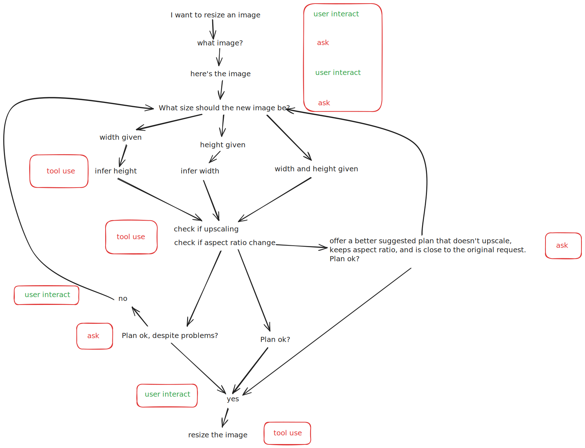

I recently took a class on ai agents. The paradigm of an ai agent goes like something like this.

First you give the agent a set of instructions and a goal written in natural language. Don't be too specific or declarative, but also don't be too vague. You'll also give the agent a set of "tools" that it can use, like the "delete_file" tool or "download_website_tool". All of this information goes into the "context" - basically a giant prompt that gets send to the LLM.

The agent receives some input. Now the goals, instructions, tools, and the input are sent to the LLM. It responds. It may ask for a tool to be used. The tool then gets used and the results get added to the context. The agent may wait for more input, or it may reach it goal on its own.

That's the classic AI agent with the promise of being extremely flexible adapters in a workflow. If you change the interface on your API tools, in the perfect world the agent would automatically adapt to those changes and continue to work as before. That sounds pretty neat.

Very generally, an agent looks like this.

```
loop {
    input -> "intelligence" doing reasoning and using tools
}
```

But I wondered, what if we replaced the "intelligence" of an LLM with a dumber, more deterministic "intelligence". Like a simple state machine workflow. This repo is a scratch pad for that idea. It drops the user into a prompt and asks them to fill out some information to resize an image. A workflow sort of like this.



At the end of the workflow, the tool will spit out the final pixel size for the caller to use. It could also be expanded to do the actual resizing. This sort of dumb agent could presumably be used in an agent environment if the framework allowed agents to interact with CLI tools.

Below you can see the workflow. You can run it yourself in a [wasmtime sandbox](https://github.com/bytecodealliance/wasmtime/tree/main) using the `dist/dimension_parser_cli.wasm` file. Note the --dir=. which allows the WASM program to use only the files in the current directory.

```
> wasmtime run --dir=. ./dist/dimension_parser_cli.wasm

What image would you like to resize?
>> /image.webp
Ok, we can resize that image.
What dimensions do you want for the resized image?
>> Ok. I can resize /image.webp to 500 x 500 pixels for you. Do you want me to do this for you?
>> Ok. Complete. (simulated)
{"width":500,"height":500}
```

Or if you're working with physical dimensions...

```
> wasmtime run --dir=. ./dist/dimension_parser_cli.wasm

What image would you like to resize?
>> image.webp
Ok, we can resize that image.
What dimensions do you want for the resized image?
>> 3in x 2.67in
What dpi value do you want? (300 is ideal)
>> 300
300
Ok. I can resize /image.webp to 900 x 801 pixels. Do you want me to do this for you?
>> yes
Ok. Complete. (simulated)
{"width":900,"height":801}
```

---

# Building

If you want to run this without wasm, just run `cargo run`.

If you want to build the wasm file yourself:

1. Make sure you have the wasm32-wasip2 target installed. `rustup target add wasm32-wasip2`
2. cargo build --target wasm32-wasip2 --release
3. Build file will be in `target/wasm32-wasip2/release/dimension_parser_cli.wasm`